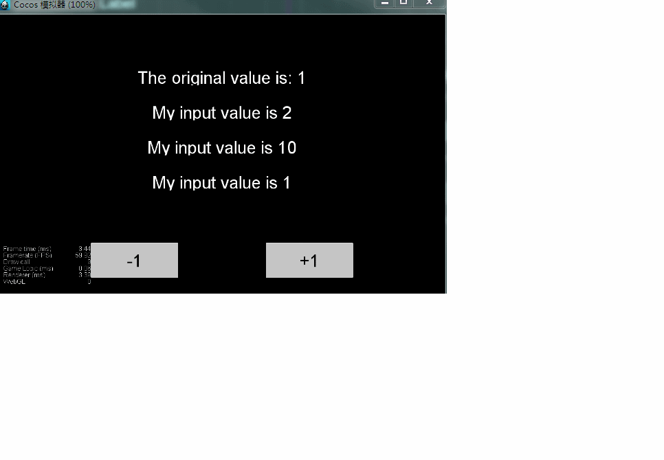

## CocosProjectTemplate For WxGame


**这是Shephy分支，尝试去实现Shephy**

1. All purpose sheep 万能卡 1 Choose a card in your hand, Play this card as a copy of it.
2. Be Fruitful 繁殖 3  复制一个单位 duplicate one of your sheep card 
3. Crowding 过密 1 release until 2 
4. Dominion  统率 2 合成指定的Cards replace them with one sheep card of equal or lesser value;
5. Falling Rock 落石 1 destory 1 unit
6. Fill the Earth 铺满 1 获取指定数量的unit1
7. Flourish 繁荣 1 选择level 为n的unit获得 unit_(n-1) * 3
8. Golden Hooves 黄金蹄 1 level up all cards except the max
9. Inspiration 灵感 1 select one card from card set
10. Lighting 闪电 1 destory the max unit
11. Mentor 陨石 1 remove tgus card from the game and then release three sheep cards
12. Multiply Place `3 sheep card` in the Field
13. Plague 疾病 `Release` all sheep cards of one rank
14. Planning Sheep 对策 `remove` one card in your hand from the game
15. Sheep Dog 🐑 🐕 `Discard` one card from your hand
16. Shephion 屠🐑者 `Release` 7 Sheep cards
17. Slump 爆落 `Release` half of your sheep cards
18. Storm 岚 `Release` 2 sheep cards
19. Wolves 狼群 `Release` the rank of your highest-ranking sheep card by one. If it equals 1, `release` it;

### The Game Rule
- Field 场地
- hand 手牌
- discardPile 弃牌堆
- deck 卡牌堆
- exilePile 流放堆

起始状态：
(deck, hand, discardPile, Field, exilePile, stock) <- initial
(hand, deck) <- sample(4, deck)

1. 回合开始
1.1 抽牌
(hand, deck) <- draw

1.2 选择一张牌使用
`card` <- select

case _ of 
    Nothing -> 1.4
    Extra -> 1.3

1.3 额外选择阶段
可以选择的内容
- units in field
- card in hand 
- card in deck 

`extraUnit` <- extraSelect
case _ of
    Card -> 
        case region of
            Hand -> exec handIndex
            Deck -> exec deckIndex
    Field -> exec fieldIndex

1.4 结算
1. settle(card.type, extraUnit);
    1.1 将card移到弃牌堆
    1.2 结算其他卡牌
    1.3 结算场地效果
2. isDeckEmpty?
    2.1 True -> shuffleDeck
    2.2 False -> Nothing

=> goto 1.1
            


### Shephy
- 场地
- 手牌
- 弃牌堆
- 卡组剩余牌
- 流放堆


## **注意**
- child的初始化需要在onLoad中


## Examples
- example1: counter
- example2: TODO list
- example3: Container & Child Component





v0.1.1:
加入wxapi的一些借口
- `showBannerAd` 在屏幕下方显示每30s刷新一次的广告
- `getVedioAd :: () => Maybe RewardVedioAd` 获取视频广告 

定时器的实现
```typescript
let timer = new Timer();
let total = 20;
timer.on('ontick', (d: number) => console.log(d))
    .on("onend", () => console.log("end"))
    .start(total);

// ontick需要在start前注册。或者注册后重新start
// start(duration?: number): void;
timer.pause();
timer.start(); // 暂停后可以调用start开始
```

v0.1: 
- 删除actions: Subject<Action>


# -*- mode: snippet -*-
# name: 
# key:
# --

